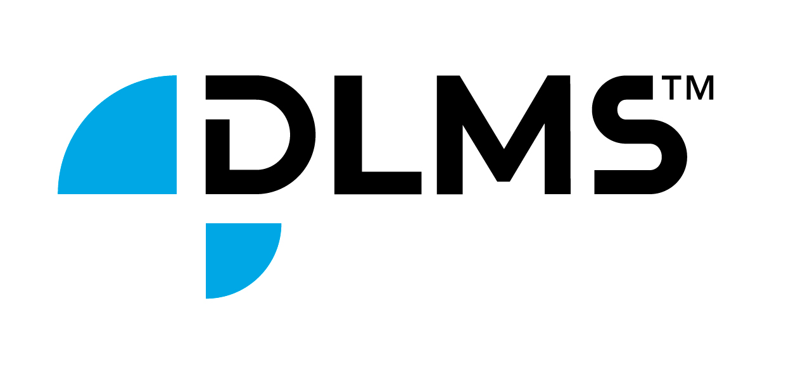

# A Python library for DLMS/COSEM.

[](https://github.com/u9n/dlms-cosem/actions/workflows/test.yml)
[](https://github.com/u9n/dlms-cosem/actions/workflows/docs.yml)



# Installation

```bash
uv add dlms-cosem
```

If you are not using a project-managed environment, you can also run:

```bash
uv pip install dlms-cosem
```

Or with pip:

```bash
pip install dlms-cosem
```

# Key Management

The library includes comprehensive key management utilities for DLMS/COSEM security:

## Quick Start

```python
from dlms_cosem.key_management import KeyManager

# Generate new keys
profile = KeyManager.generate(suite=0, name="my_meter")
KeyManager.save(profile, "keys.toml")

# Load configuration (auto-detects from env vars or files)
profile = KeyManager.load()
```

## CLI Tool

```bash
# Generate keys
dlms-keys generate --suite 0 --output keys.toml

# Validate configuration
dlms-keys validate --file keys.toml

# Rotate keys
dlms-keys rotate --file keys.toml --keep-backup
```

## Installation with Key Management

For full key management features (TOML/YAML config files):

```bash
uv add dlms-cosem[keys]
```

See [docs/key_management.md](docs/key_management.md) for detailed documentation.

# Documentation

* [Architecture Documentation](docs/ARCHITECTURE.md) - Library architecture and design
* [API Reference](docs/api_reference.md) - Complete API documentation
* [Error Audit](docs/error_audit.md) - Error handling audit report
* [Changelog](CHANGELOG.md) - Version history
* Full documentation can be found at [www.dlms.dev](https://www.dlms.dev)

# Architecture

```
┌─────────────────────────────────────────────┐
│              Application Layer               │
│  (client.py / server.py / automation.py)    │
├─────────────────────────────────────────────┤
│              Protocol Layer                  │
│  ┌──────────┐  ┌──────────┐  ┌───────────┐ │
│  │  xDLMS   │  │  ACSE    │  │  Wrappers │ │
│  │ (APDU)   │  │ (Assoc)  │  │           │ │
│  └──────────┘  └──────────┘  └───────────┘ │
├─────────────────────────────────────────────┤
│              Security Layer                  │
│  (HLS/LLS/GMAC/GlobalCipher/SM4)            │
├─────────────────────────────────────────────┤
│              Transport Layer                 │
│  ┌────┐  ┌────┐  ┌─────┐  ┌──────────┐    │
│  │HDLC│  │TCP │  │TLS  │  │NB-IoT/LP │    │
│  └────┘  └────┘  └─────┘  └──────────┘    │
├─────────────────────────────────────────────┤
│              COSEM Objects                   │
│  (40+ IC Classes: Register, Clock, PG...)   │
├─────────────────────────────────────────────┤
│              Data Layer                      │
│  (A-XDR / BER / DLMS Data Types)            │
└─────────────────────────────────────────────┘
```

# Examples

The `examples/` folder contains comprehensive examples:

* [hdlc_parameter_negotiation.py](examples/hdlc_parameter_negotiation.py) - HDLC parameter negotiation
* [profile_generic_read_methods.py](examples/profile_generic_read_methods.py) - Profile Generic access methods
* [exception_handling.py](examples/exception_handling.py) - Error handling patterns

Run examples directly:
```bash
uv run python examples/hdlc_parameter_negotiation.py
uv run python examples/profile_generic_read_methods.py
uv run python examples/exception_handling.py
```

# About

`dlms-cosem` is designed to be a tool with a simple API for working with DLMS/COSEM
enabled energy meters. It provides the lowest level function, as protocol state
management, APDU encoding/decoding, APDU encryption/decryption.

The library aims to provide a [sans-io](https://sans-io.readthedocs.io/) implementation
of the DLMS/COSEM protocol so that the protocol code can be reused with several
io-paradigms. As of now we provide a simple client implementation based on
blocking I/O. This can be used over either a serial interface with HDLC or over TCP.

We have not implemented full support to be able to build a server (meter) emulator. If
this is a use-case you need, consider sponsoring the development and contact us.

# Supported features

* AssociationRequest  and AssociationRelease
* GET, GET.WITH_BLOCK, GET.WITH_LIST
* SET With Block, SET With List
* ACTION With Block, ACTION With List
* DataNotification
* GlobalCiphering - Authenticated and Encrypted
* HLS-GMAC, LLS, HLS-Common auth
* Selective access via RangeDescriptor and EntryDescriptor
* Parsing of ProfileGeneric buffers
* **HDLC parameter negotiation** - Optimize connection performance
* **Exception hierarchy** - Unified error handling with error codes

## New Features (v2026.1.0)

### HDLC Parameter Negotiation

Negotiate HDLC connection parameters to improve performance:

```python
from dlms_cosem.hdlc import HdlcParameterList

# Create SNRM frame with proposed parameters
params = HdlcParameterList()
params.set_window_size(5)  # Up to 5 frames without ACK
params.set_max_info_length_tx(1024)  # Up to 1024 bytes per frame

# Use in SNRM/UA frames
snrm = SetNormalResponseModeFrame(
    destination_address=client_addr,
    source_address=server_addr,
    parameters=params
)
```

### Profile Generic Enhanced Access

Read Profile Generic data more efficiently:

```python
from datetime import datetime

# Read by time range
data = client.get_with_range(
    profile_attribute,
    from_value=datetime(2024, 1, 1),
    to_value=datetime(2024, 1, 31)
)

# Read by entry with column filtering
data = client.get_with_entry(
    profile_attribute,
    from_entry=1,
    to_entry=100,
    from_selected_value=1,
    to_selected_value=5  # Only columns 1-5
)
```

### Unified Exception Hierarchy

Better error handling with structured error information:

```python
from dlms_cosem.exceptions import (
    DlmsException,
    DlmsConnectionError,
    DlmsSecurityError,
    create_timeout_error,
)

try:
    data = client.get(attribute)
except DlmsTimeoutError as e:
    print(f"Timeout: {e.message}, Code: {e.error_code}")
    # Retry with backoff
except DlmsSecurityError as e:
    print(f"Security error: {e.message}")
    # Check credentials
except DlmsException as e:
    print(f"DLMS error: {e.message}")
```

# Example use:

A simple example of reading invocation counters using a public client:

```python
from dlms_cosem.client import DlmsClient
from dlms_cosem.io import IPTransport, BlockingTcpIO
from dlms_cosem.security import NoSecurityAuthentication
from dlms_cosem import enumerations, cosem

tcp_io = BlockingTcpIO(host="localhost", port=4059)
ip_transport = IPTransport(io=tcp_io, server_logical_address=1, client_logical_address=16)
client = DlmsClient(transport=ip_transport, authentication=NoSecurityAuthentication())
with client.session() as dlms_client:
    data = dlms_client.get(
        cosem.CosemAttribute(interface=enumerations.CosemInterface.DATA,
                             instance=cosem.Obis(0, 0, 0x2B, 1, 0), attribute=2, ))
```

`TcpTransport` is kept as a backward-compatible alias of `IPTransport`.

Look at the different files in the `examples` folder get a better feel on how to fully
use the library.

# Supported meters

Technically we aim to support any DLMS enabled meter. The library is implementing all
the low level DLMS, and you might need an abstraction layer to support everything in
your meter.

DLMS/COSEM specifies many ways of performing tasks on a meter. It is
customary that a meter also adheres to a companion standard. In the companion standard
it is defined exactly how certain use-cases are to be performed and how data is modeled.

Examples of companion standards are:
* DSMR (Netherlands)
* IDIS (all Europe)
* UNI/TS 11291 (Italy)

On top of it all your DSO (Distribution Service Operator) might have ordered their
meters with extra functionality or reduced functionality from one of the companion
standards.

We have some meters we have run tests on or know the library is used for in production

* Pietro Fiorentini RSE 1,2 LA N1. Italian gas meter
* Iskraemeco AM550. IDIS compliant electricity meter.
* Itron SL7000
* Hexing HXF300


# License


*The `dlms-cosem` library is released under the Business Source License 1.1 .
It is not a fully Open Source License but will eventually be made available under an Open Source License
(Apache License, Version 2.0), as stated in the license document.*

Our goal with this licence is to provide enough freedom for you to use and learn from the software without
[harmful free-riding](https://en.wikipedia.org/wiki/Free-rider_problem).

---

You may make use of the Licensed Work for any Permitted Purpose other than a Competing Use.
A Competing Use means use of the Licensed Work in or for a commercial product or service that
competes with the Licensed Work or any other product or service we offer using the Licensed Work
as of the date we make the Software available.

Competing Uses specifically include using the Licensed Work:

1. as a substitute for any of our products or services;

2. in a way that exposes the APIs of the Licensed Work; and

3. in a product or service that offers the same or substantially similar
functionality to the Licensed Work.

Permitted Purposes specifically include using the Software:

1. for your internal use and access;

2. for non-commercial education; and

3. for non-commercial research.

For information about alternative licensing arrangements or questions about permitted use of the library,
please contact us at `info(at)pwit.se`.

# Development

This library uses an `uv`-first development workflow.

```bash
uv sync --extra dev
uv run pytest
uvx pre-commit run --all-files
```

For maintainers, local releases can be built and uploaded with:

```bash
scripts/release.sh --repository testpypi
# or
scripts/release.sh
```

This library is developed by Palmlund Wahlgren Innovative Technology AB. We are
based in Sweden and are members of the DLMS User Association.

If you find a bug please raise an issue on Github.

## Contribution policy

We welcome bug reports, feature requests, and design discussions through GitHub
Issues.

To reduce security and maintenance risk in this protocol implementation, we do
not directly accept external code contributions for merge.

You are still welcome to open a pull request to illustrate an approach,
provide examples, or share tests/reproduction steps. We review these proposals,
but the maintainers implement and merge the final production code.

We add features depending on our own, and our clients use cases. If you
need a feature implemented please contact us.

# Training / Consultancy / Commercial Support / Services

We offer consultancy service and training services around this library and general DLMS/COSEM.
If you are interested in our services just reach at `info(at)pwit.se`

The library is an important part of our [Smart meter platform Utilitarian, https://utilitarian.io](https://utilitarian.io). If you need to
collect data from a lot of DLMS devices or meters, deploying Utilitarian might be the smoothest
solution for you.
